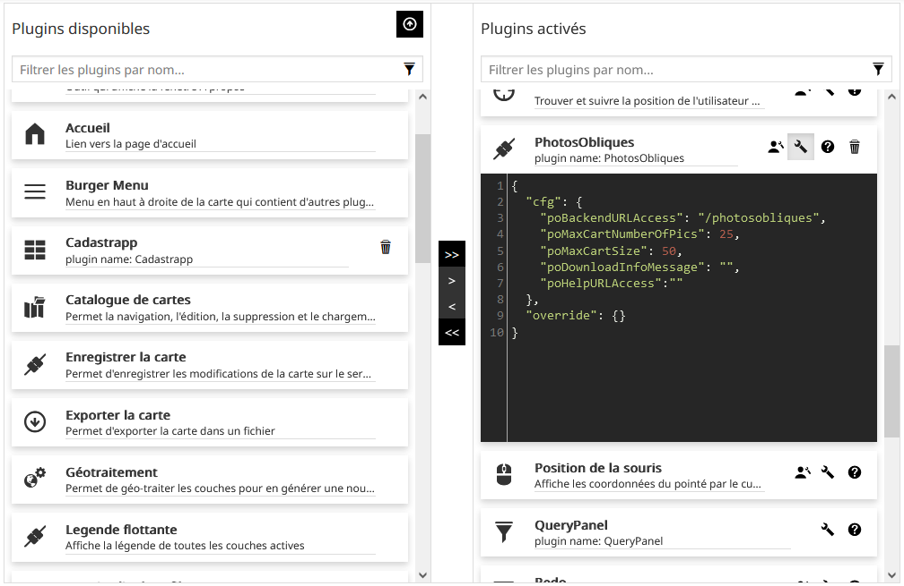

# geor_photos_obliques_Mapstore 

:fr: [Version française](docs/README_FR.MD).

## I - General Information


This application is a plugin developed by Rennes Métropole for Mapstore2 geOrchestra (https://github.com/georchestra/mapstore2-georchestra). Combined with its backend (https://github.com/sigrennesmetropole/geor_photos_obliques_backend), it allows users to search and download aerials photos by selecting them from their current map extent.

## II - Using this repository

**II.1 - Repository organization**

This repository is meant to be used with the geor_MapstoreExtension repository:

-	This repository (geor_photos_obliques_Mapstore) contains the JS code of the plugin
-	The geor_MapstoreExtension repository contains the configurations files of the plugin (configs and translations)

The "Main" branch is used for the development of the plugin. For each release of the plugin, a new branch is created. The release note will specify the mapstore2-georchestra version for which the plugin version has been created.

The settings files for each plugin release are located in the RM/photoOblique_v.NumVersion branch of the geor_MapstoreExtension repository.


**II.2 - Using the repository**

II.2.1 - Setting up the repository

To deploy this repository locally, please follow the steps below:

`git clone --recursive https://github.com/sigrennesmetropole/geor_MapstoreExtension`

select the desired branch:

`git checkout RM/photoOblique_v.VersionNum`

Where VersionNum is the desired release number. 

Then install the dependencies:

_NodeJS >= 12.16.1 is needed_

```
npm i
npm fe:start
```
The application runs at http://localhost:8081 afterwards.

II.2.2 - Settings

Proxies are managed in ./proxyConfig.js file.

Locales are managed in ./assets/translations/data.lang-LANG.json

Build configuration for local use is managed in ./configs/localConfig.json

Configuration for production build is managed in ./assets/index.json


## II.3 - Plugin deployment and installation

This project allows the creation of a zip file that can be added in your Mapstore2 for geOrchestra environment. This file can be generated using the CI/CD or manually:

**II.3.1 - CI/CD**

The project CI/CD uses the geor_MapstoreExtension CI/CD file which generates the steps of the continuous integration process. It is important to provide it with the correct project link in order to reach an instance of geor_MapstoreExtension with the correct branch (in our case RM/photoOblique_v.NumVersion) in order to retrieve the correct submodule from the geor_MapstoreExtension directory. The submodule in js/extension corresponds to the corresponding plugin's version.

The steps of the process are automatic and described in the CI files. This process can be described as follows: the plugin calls geor_MapstoreExtension, which generates a build of the plugin and deploys it in a remote repository. This repository has to be set up in the .gitlab-ci.yml of geor_MapstoreExtension ("publish" section). These steps can be modified according to the architecture of your system.

**II.3.2 - Manual Deployment**

To manually starts the build of the plugin, you need to run the following command from the root directory of the project:

`npm run ext:build`

A .zip file is created with the name of the extension in the 'dist' folder.

## III - Installing and configuring the plugin

**III.1 - Installing the plugin**

This plugin is a MapstoreExtension. To install it, simply go to the mapstore map context management interface and click on the "Add an extension to Mapstore" button in the plugin configuration interface to add the plugin using its .zip file.

This plugin works with a dedicated backend. Please follow the readme of the backend repository to install it : https://github.com/sigrennesmetropole/geor_photos_obliques_backend.

**III.2 - Configuring the plugin**



When the plugin is added to a MapStore context for geOrchestra, it needs to be configured to work correctly. These configuration parameters are:

| Parameter Name | Default Value | Description |
| ---      | ---      | ---      |
| pobackendurlaccess | "/photosobliques" | Link to the back-end used by the plugin.  |
| poMaxCartNumberOfPics | 25 | Maximum number of photos that can be added to basket. |
| poMaxCartSize | 50 | Maximum weight allowed for basket. |
| poDownloadInfoMessage | "" | Information message to display when uploading photos. |
| poHelpURLAccess | "" | Link to plugin documentation. |

The plugin is optimised for use in a map context using the EPSG:3857 projection system.

