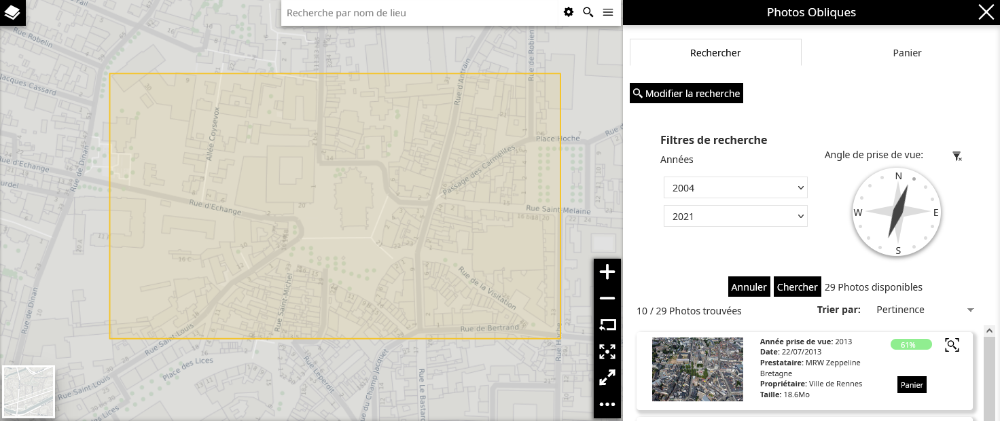
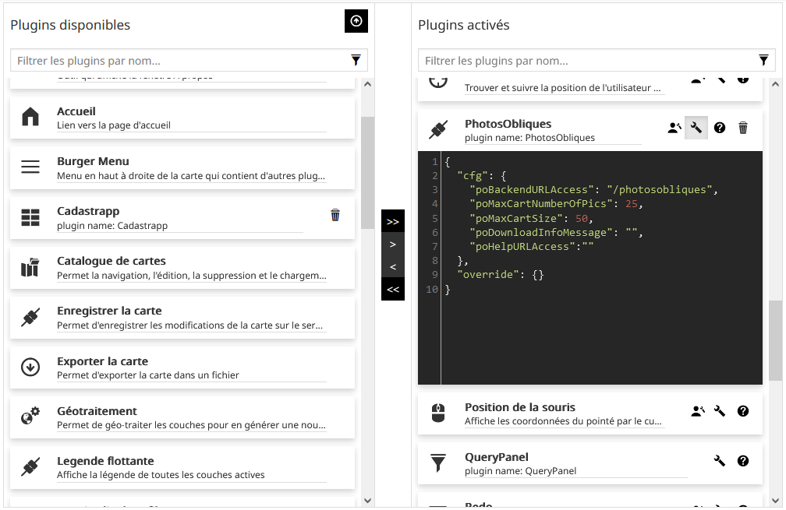

# Plugin Photos_Obliques pour MapStore2-geOrchestra

:gb: [English Version](https://github.com/sigrennesmetropole/geor_photos_obliques_Mapstore).

## I - Généralités



## II - Utilisation du présent dépôt

**II.1 - Organisation du dépôt**

Ce dépôt doit être conjointement utilisé avec le dépôt geor_MapstoreExtension :

-	Le présent dépôt (geor_photos_obliques_Mapstore) contient le code js du plugin
-	Le dépôt (geor_MapstoreExtension) contient les fichiers de paramétrage du plugin (configuration et locales)

La branche Main est la branche de développement du plugin. À chaque release, une branche est créée pour permettre une gestion facilitée des versions du plugin. La note de release précisera la version de mapstore2-georchestra pour laquelle la version du plugin a été créée.

Les fichiers de paramétrage de chaque release du plugin se situent dans la branche RM/photoOblique_v.NumVersion du dépôt geor_MapstoreExtension.

**II.2 - Utilisation du dépôt**

II.2.1 - Mise en place du dépôt

Pour mettre en place ce dépôt il faut suivre la procédure suivante : 

`git clone --recursive https://github.com/sigrennesmetropole/geor_MapstoreExtension`

Puis il faut sélectionner la bonne branche

`git checkout RM/photoOblique_v.NumVersion`

Où NumVersion est le numéro de release souhaité. Il faut par la suite installer les dépendances.

Il faut s'assurer d'avoir une version de NodeJS supérieure à node 12.16.1, puis suivre la procédure suivante : 

```
npm i
npm fe:start
```
L'application est accessible via http://localhost:8081

II.2.2 - Configuration

La gestion des proxies se tient dans ./proxyConfig.js

La gestion des locales se tient dans ./assets/translations/data.lang-LANG.json

La gestion de la configuration en build pour l'utilisation locale se fait dans ./configs/localConfig.json

La gestion de la configuration pour le build de production 

## II.3 - Déploiement du plugin

Ce dépôt permet la création d'un fichier .zip du plugin pouvant être ajouté dans Mapstore2 pour geOrchestra. La génération de ce fichier est permise par l'utilisation de la CI/CD ou peut-être réalisée manuellement : 

II.3.1 – CI/CD

La CI/CD du projet fait appel au fichier de CI/CD de geor_MapstoreExtension qui génère les étapes du processus d'intégration continue. Il est important de lui fournir le bon lien de projet afin de bien atteindre une instance de geor_MapstoreExtension et la bonne branche (dans notre cas RM/photoOblique_v.NumVersion) afin de récupérer le bon sous module dans le répertoire de MapstoreExtension. Le sous module dans js/extension correspond au plugin associé à la branche sélectionnée.

Les étapes suivantes sont automatiques : le plugin appelle MapstoreExtension qui génère un build du plugin et le dépose sur un dépôt distant. Ce dépôt est à paramétrer dans le .gitlab-ci.yml de geor_MapstoreExtension section "publish". Ces étapes sont modifiables en fonction des réalités architecturales du système d'information de l'opérateur.

II.3.2 – Déploiement manuel

Pour lancer le build manuellement, il vous faut lancer la commande suivante à partir de la racine du projet :

`npm run ext:build`

Cela va créer un .zip avec le nom de l'extension dans le dossier 'dist' qui est le plugin compilé. 


### III - Installation et configuration du plugin

**III.1 – Installation du plugin**

Ce plugin est une MapstoreExtension. Il suffit pour l'installer d'accéder à l'interface d'administration de contexte de carte puis dans l'interface de configuration des plugins, de cliquer sur le bouton "Ajouter une extension à Mapstore" pour ajouter le plugin à l'aide de son fichier .zip.

Ce plugin fonctionne avec un backend dédié. Pour procéder à son installation, merci de suivre le readme présent sur son dépôt : https://github.com/sigrennesmetropole/geor_photos_obliques_backend.


**III.2 – Configuration du plugin**



Lors de l'ajout du plugin dans un contexte MapStore pour geOrchestra, celui-ci doit être configuré pour fonctionner correctement. Ces paramètres de configuration sont les suivants : 

| Nom du paramètre | Valeur par défaut | Description |
| ---      | ---      | ---      |
| pobackendurlaccess | "/photosobliques" | Lien d’accès au back utilisé par le plugin.  |
| poMaxCartNumberOfPics | 25 | Nombre maximal de photos pouvant être ajoutées au panier |
| poMaxCartSize | 50 | Poids maximal autorisé pour le panier |
| poDownloadInfoMessage | "" | Message d'information à afficher lors du téléchargement des photos |
| poHelpURLAccess | "" | Lien d'accès à la documentation du plugin |

Le plugin est optimisé pour une utilisation dans un contexte de carte utilisant le système de projection EPSG:3857.
