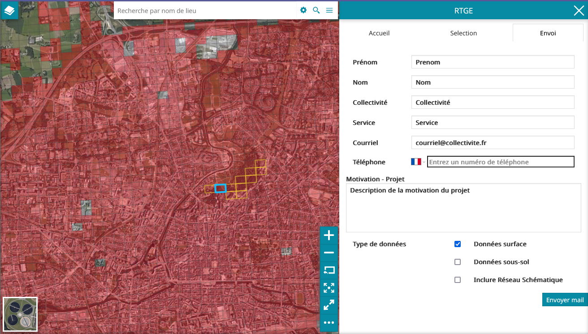
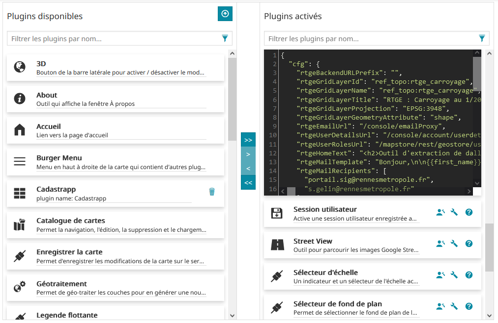

#/!\ - mise à jour nécessaire en fonction du content PhotoObliques
# Plugin RTGE pour Mapstore2-geOrchestra

:gb: [English version](https://github.com/sigrennesmetropole/geor_RTGE_Mapstore)

## I - Généralités



Ce plugin MapStore2 permet d'effectuer des demandes d'extraction de données à partir d'une couche de carroyage. Les dalles couvrant l'emprise géographique doivent être sélectionnées, puis un formulaire permettant de formuler sa demande est à compléter. Un mail est ensuite envoyé au service chargé d'effectuer l'extraction de ces données.

À Rennes Métropole, ce plugin est utilisé pour la gestion des extractions des données du RTGE (Référentiel Topographique très Grande Échelle) au format DXF.


## II - Utilisation du présent dépôt
**II.1 - Organisation du dépôt**

Ce dépôt doit être conjointement utilisé avec le dépôt geor_MapstoreExtension : 
-	Le présent dépôt (geor_RTGE_Mapstore) contient le code js du plugin RTGE
-	Le dépôt (geor_MapstoreExtension) contient les fichiers de paramétrage du plugin RTGE (configuration et locales)

La branche Main est la branche de développement du plugin. À chaque release, une branche est créée pour permettre une gestion facilitée des versions du plugin. La note de release précisera la version de mapstore2-georchestra pour laquelle la version du plugin a été créée.

Les fichiers de paramétrage de chaque release du plugin se situent dans la branche RM/RTGE_v.NumVersion du dépôt geor_MapstoreExtension.

**II.2 - Utilisation du dépôt**

II.2.1 - Mise en place du dépôt

Pour mettre en place le dépôt il faut suivre la procédure suivante : 

`git clone --recursive https://github.com/sigrennesmetropole/geor_MapstoreExtension`

Puis il faut sélectionner la bonne branche

`git checkout RM/RTGE_v.NumVersion`
Où NumVersion est le numéro de release souhaité de RTGE. Il faut par la suite installer les dépendances.  

Il faut s'assurer d'avoir une version de NodeJS supérieure à node 12.16.1, puis suivre la procédure suivante : 
```
npm i
cd MapStore2
npm i
cd ../mapstore2-georchestra
npm i
npm fe:start
```
L'application est accessible : http://localhost:8081

II.2.2 - Configuration

La gestion des proxies se tient dans ./proxyConfig.js

La gestion des locales se tient dans ./assets/translations/data.lang-LANG.json

La gestion de la configuration en build pour l'utilisation locale se fait dans ./configs/localConfig.json

La gestion de la configuration pour le build de production se fait dans ./assets/index.json

**II.3 - Déploiement du plugin**

Ce dépôt permet la création d'un fichier .zip du plugin RTGE pouvant être ajouté dans Mapstore2 pour geOrchestra. La génération de ce fichier est permise par l'utilisation de la CI/CD ou peut-être réalisée manuellement : 

II.3.1 - CI/CD

La CI/CD du projet RTGE fait appel au fichier de CI/CD de geor_MapstoreExtension qui génère les étapes du processus d'intégration continue. Il est important de lui fournir le bon lien de projet afin de bien atteindre une instance de geor_MapstoreExtension et la bonne branche (dans notre cas RM/RTGE_v.NumVersion) afin de récupérer le bon sous module dans le répertoire de MapstoreExtension. Le sous module dans js/extension correspond au plugin associé (RM/RTGE_v.NumVersion = RTGE version NumVersion)

Les étapes suivantes sont automatiques et inscrites dans les différentes étapes des fichiers de CI. Ce processus se décrit comme suit : RTGE appelle MapstoreExtension qui génère un build du plugin et le dépose sur un dépôt distant. Ce dépôt est à paramétrer dans le .gitlab-ci.yml de geor_MapstoreExtension section "publish". Ces étapes sont modifiables en fonction des réalités architecturales du système d'information de l'opérateur.


II.3.2 - Déploiement manuel

Pour lancer le build manuellement, il vous faut lancer la commande suivante à partir de la racine du projet :

`npm run ext:build`

Cela va créer un .zip avec le nom de l'extension dans le dossier 'dist' qui est le plugin compilé. 

## III - Installation et configuration du plugin
**III.1 - Installation du plugin**

Ce plugin est une MapstoreExtension. Il suffit pour l'installer d'accéder à l'interface d'administration de contexte de carte mapstore et dans l'interface de configuration des plugins, de cliquer sur le bouton "Ajouter une extension à Mapstore" pour ajouter le plugin à l'aide de son fichier .zip.

**III.2 - Configuration du plugin**



Lors de l'ajout du plugin dans un contexte MapStore pour geOrchestra, celui-ci doit être configuré pour fonctionner correctement. Ces paramètres de configuration sont les suivants : 

| Parameter Name | Default Value | Description |
| ---      | ---      | ---      |
| rtgeBackendURLPrefix | "" | Lien d’accès au back utilisé par le plugin. À ce jour, ce plugin fonctionne sans back. |
| rtgeGridLayerId | "ref_topo:rtge_carroyage" | ID dans le contexte de carte, de la couche de carroyage utilisée pour la sélection des zones d'extraction des données. |
| rtgeGridLayerName | "ref_topo:rtge_carroyage" | Nom dans le contexte de carte, de la couche de carroyage utilisée pour la sélection des zones d'extraction des données. |
| rtgeGridLayerTitle | "RTGE : Carroyage au 1/200" | Titre dans le contexte de carte, de la couche de carroyage utilisée pour la sélection des zones d'extraction des données. |
| rtgeGridLayerProjection | "EPSG:3948" | EPSG du système de projection natif utilisée par la couche de carroyage |
| rtgeGridLayerGeometryAttribute | "shape" | Nom de l'attribut de la couche de carroyage contenant la géométrie des dalles. |
| rtgeEmailUrl | "/console/emailProxy" | Lien vers le serveur de mail à utiliser. |
| rtgeUserDetailsUrl | "/console/account/userdetails" | Lien à partir duquel les informations de l’utilisateur connecté sont récupérée pour pré-remplir le formulaire. |
| rtgeUserRolesUrl | "/mapstore/rest/geostore/users/user/details?includeattributes=true" | Lien à partir duquel les informations de rôle de l’utilisateur connecté sont récupérée pour vérifier ses droits à consulter les données à accès restreint. |
| rtgeHomeText | "" | Texte au format html qui sera affiché sur l'onglet accueil du plugin RTGE. |
| rtgeMailRecipients | "" | Liste contenant au format texte les adresses mèl des destinataires de la demande d'extraction de données. Ces adresses doivent être préalablement ajoutées dans la liste  blanche emailProxyRecipientWhitelist du fichier console.properties de geOrchestra. |
| RtgeMailSubject | "" | Corps de texte du mail à envoyer. Il contiendra les variables remplacées par les valeurs du formulaire : <br>-{{first_name}}<br>-{{last_name}}<br>-{{email}}<br>-{{tel}}<br>-{{service}} <br>-{{company}}<br>-{{aboveground}}<br>-{{underground}}<br>-{{undergroundDataIsRequired}}<br>-{{schematicalnetwork}}<br>-{{comments}} |
| rtgeMailSubject | "" | Objet du mail envoyé. Peut contenir le nombre de dalles sélectionnées : {{count}} |
| rtgeMaxTiles | "50" | Nombre maximal de dalles pouvant être sélectionnées. |
| rtgeTileIdAttribute | "id_case" | Nom du champ attributaire contenant l'identifiant de la dalle. Ce sont ces identifiants qui sont envoyés sous forme de liste dans le mail de demande d'extraction. |
| rtgeTilesAttributes | [{<br>"attribute": "id",<br>"title":"Identifiant",<br>"colWidth": "col-sm-5"<br>},<br>{<br>"attribute":"date ",<br>"title": "Date MAJ",<br>"colWidth":"col-sm-3"<br>}] | Liste contenant les attributs qui seront affichés dans le tableau des dalles sélectionnées. Pour Chaque attributs : <br>-	Attribute : nom de l'attribut à afficher<br>-	Title : alias qui sera affiché en en-tête de colonne<br>-	colWidth : valeur de largeur de la colonne de la forme "col-sm-X" X étant la valeur de la largeur souhaitée. Il est recommandé que le total des valeurs de largeurs de colonnes ne dépasse pas 12. |
| rtgeUndergroundDataRoles | "EL_APPLIS_RMTR_SSOL" | Nom du rôle utilisateur autorisé à consulter les données à accès restreint. |

Le plugin est optimisé pour une utilisation dans un contexte de carte utilisant le système de projection EPSG:3857, et a été testé dans un environnement utilisant le système de projection EPSG:3948.
